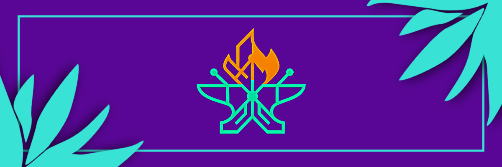
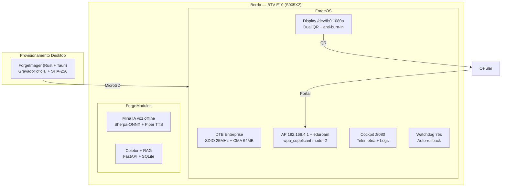
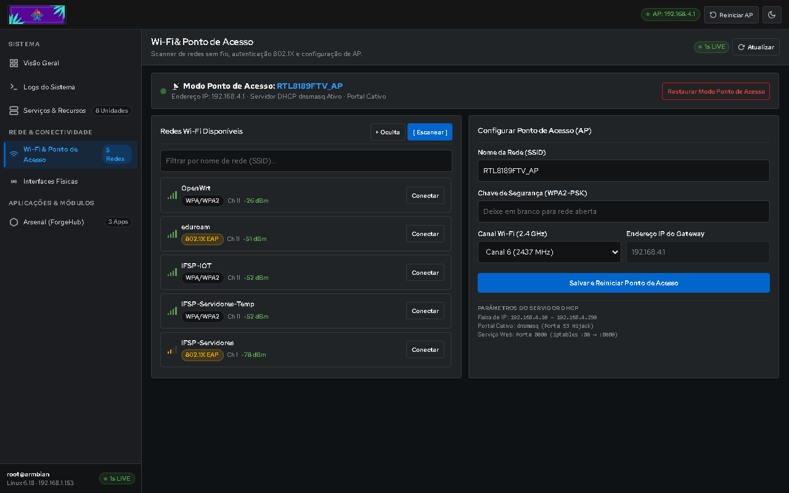
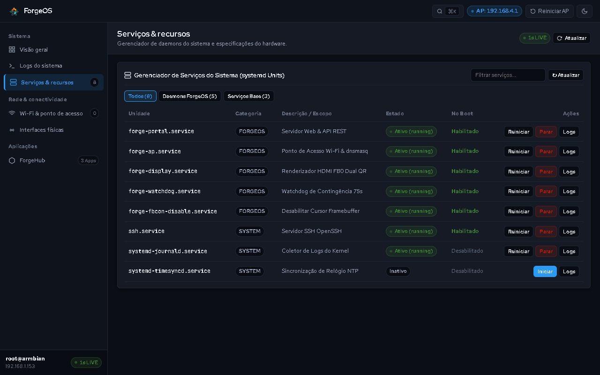
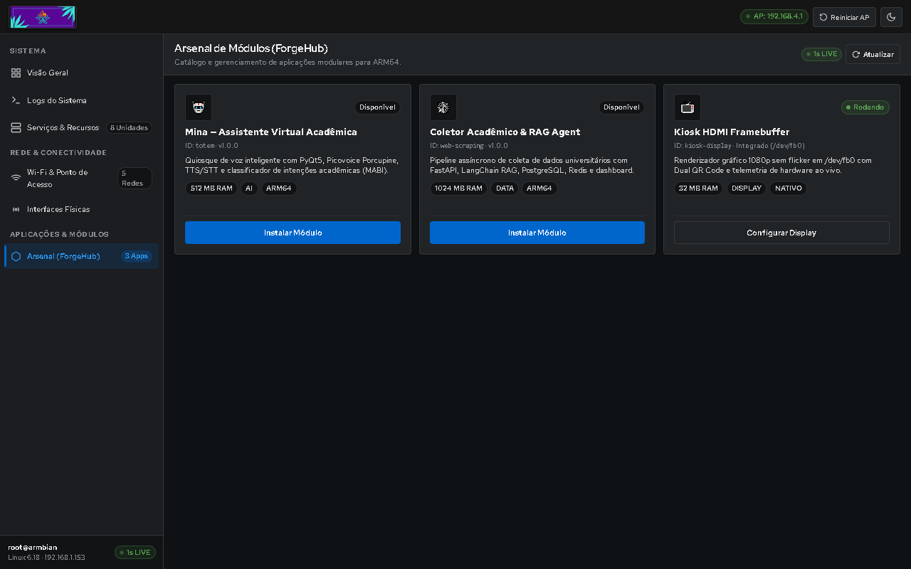

<p align="center">
  
</p>

<p align="center">
  
  
  
  
</p>

# MultiForge – Plataforma de Descaracterização e Reaproveitamento de TV Boxes Apreendidas

> 1º Hackathon TV Box Unesp Sorocaba — Equipe 1

**Resumo oficial:** O MultiForge é uma plataforma open-source que automatiza a descaracterização da TV Box BTV E10 apreendida, transformando-a em equipamento educacional seguro. O objetivo é evitar a destruição e viabilizar doação para prefeituras e escolas. Ele cataloga hardware em ForgeDB, grava Linux otimizado via ForgeImager, provisiona Wi-Fi sem internet por portal cativo e kiosk HDMI com rollback automático, e executa módulos de borda. Sua aplicação principal é o totem educacional com IA offline Mina e coletor acadêmico, sem exigir hardware externo.

**Repo principal (código completo):** https://github.com/multi-forge/multi-forge

---

## Membros da Equipe 1

* Brenda Biral
* Adriel Henrique Souza
* Isaac Andrade
* Luiz Antonio
* Marcos Oliveira E Silva
* Rafael de Sa Mascarenhas

---

## Por que com 1 TV Box só nós levamos vantagem

O edital entrega **1 BTV E10 por equipe, sem periféricos**. Projetos que exigem ESP32, dongle Zigbee/LoRa, webcam USB ou servidor externo não escalam para doação em prefeituras.

O MultiForge roda com **só TV + celular**:

1. Grava o cartão SD no PC (ForgeImager ou Raspberry Pi Imager)
2. Liga a box no HDMI — aparece QR do Wi-Fi na TV
3. Celular lê o QR, abre `http://192.168.4.1:8080`, escolhe o Wi-Fi
4. Se errar a senha, watchdog restaura o AP sozinho (rollback 75s)
5. Sem internet, sem cabo USB-USB, sem sensor externo

## Demo em 3 minutos (roteiro da final 18/09)

1. **0:00** — Box liga, TV mostra QR (`imagens/07_ForgeOS_HDMI_Dual_QR_Framebuffer_1080p.png`)
2. **0:30** — Celular conecta no AP, abre portal, faz scan real
3. **1:30** — Provisiona eduroam/WPA2, TV muda para telemetria (temp/RAM/IP)
4. **2:00** — Mostra Cockpit `:8080` + logs RFC 5424 + módulos Mina/RAG
5. **2:30** — Erra a senha de propósito, mostra FAILED → AP restaurado

## Arquitetura



## Telas reais (sem mock)

| HDMI Framebuffer /dev/fb0 | Cockpit Web |
| :---: | :---: |
|  |  |

| Rede | Serviços |
| :---: | :---: |
|  |  |

| Módulos | Logs RFC 5424 | Mobile |
| :---: | :---: | :---: |
|  |  |  |

## Como reproduzir

### 1. Binários
* Imagem + gravador: https://github.com/gasiepgodoy/Hackathon-TV-Box-E10/releases/tag/equipe1-v1.1.0

### 2. Passo a passo
1. Grave o `.img.xz` no MicroSD via ForgeImager
2. Insira na BTV E10, ligue HDMI + energia
3. No celular, leia o QR da TV, conecte no AP
4. Abra `http://192.168.4.1:8080`, escolha o Wi-Fi
5. SSH (opcional): `ssh root@192.168.4.1`

## Estrutura

```
Projeto Equipe 1/
├── README.md
├── ForgeOS/       # AP + portal :8080 + display fb0 + systemd + tests
├── ForgeDB/       # devices/btv/e10 + schemas + modules catalog
├── ForgeModules/  # totem (Mina) + sub-modulos (coletor RAG)
├── ForgeImager/   # Tauri + Rust + React + forge-write-conf
├── docs/          # auditorias e arquitetura
└── imagens/       # prints reais + logo.png (banner)
```

## Evidências técnicas

* DTB `meson-g12a-btv-e10-enterprise.dts`: SDIO 25MHz (RTL8189FTV), CMA 64MB, watchdog on
* Portal 13KB, zero dependência externa, EAP completo (PEAP/TTLS/PWD/TLS)
* ForgeDB validado em CI (JSON Schema Draft 2020-12) + CDN jsDelivr + fallback offline
* 34 testes Provisioner (units + integração + E2E Playwright)

## Licença

MIT — 1º Hackathon TV Box Unesp Sorocaba (2026).
