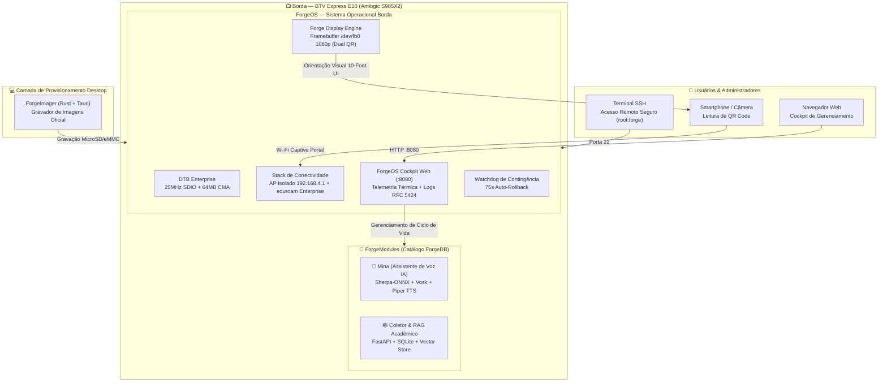

# 🚀 Equipe 1 — MultiForge / ForgeOS: Ecossistema Modular & Sistema Operacional para TV Box BTV E10

> **1º Hackathon TV Box Unesp Sorocaba**  
> *Transformando hardware apreendido em infraestrutura educacional, totens inteligentes de IA e servidores de alta eficiência.*

---

## 👥 Membros da Equipe 1
* **Brenda Biral**
* **Adriel Henrique Souza**
* **Isaac Andrade**
* **Luiz Antonio**
* **Marcos Oliveira E Silva**
* **Rafael de Sá Mascarenhas**

---

## 💡 Visão Geral do Projeto

O **MultiForge** é uma solução completa de engenharia de software e firmware desenvolvida especificamente para descaracterizar, otimizar e reaproveitar aparelhos **BTV Express E10 (Amlogic S905X2)** apreendidos em operações da Receita Federal e ANATEL. 

Em vez de criar uma aplicação isolada, a **Equipe 1** desenvolveu um **ecossistema em 4 camadas** composto por:
1. **ForgeOS:** Uma distribuição Linux Armbian customizada e enxuta, com DTB Enterprise compilada sob medida (resolvendo o clock de 25MHz e 64MB CMA do Wi-Fi RTL8189FTV), interface de pareamento HDMI Framebuffer 1080p sem dependência de X11 e Portal Cativo de provisionamento responsivo.
2. **ForgeDB:** O catálogo central e schema de validação que define as capacidades de hardware e registra os manifestos de ciclo de vida dos módulos.
3. **ForgeModules:** Módulos funcionais desacoplados prontos para uso:
   - 🤖 **Mina — Assistente Virtual Acadêmica:** Quiosque inteligente de voz operando 100% offline na borda com ONNX, detecção de intenções e síntese de voz para atendimento no ICT Unesp.
   - 🕸️ **Coletor Acadêmico & Agente RAG:** Pipeline assíncrono de coleta e indexação de dados universitários com FastAPI, LangChain e SQLite.
4. **ForgeImager:** Aplicativo desktop multiplataforma moderno (construído em **Rust + Tauri + React**) para gravação automatizada da ISO no MicroSD/eMMC com verificação criptográfica SHA-256.

---

## 🏗️ Arquitetura do Sistema



---

## 📸 Capturas de Tela do Sistema em Produção Real

| 📺 1. Painel HDMI Framebuffer 1080p (`/dev/fb0`) | 📊 2. Cockpit Web (Telemetria Térmica & Recursos) |
| :---: | :---: |
|  |  |

| 📜 3. Visualizador de Logs RFC 5424 em Tempo Real | 📱 4. Responsividade Mobile do Portal Cativo |
| :---: | :---: |
|  |  |

---

## 📁 Estrutura de Diretórios da Equipe 1

```
Projeto Equipe 1/
├── README.md               # Documentação principal do projeto
├── ForgeOS/                # Stack do Sistema Operacional
│   ├── bin/                # Scripts de ciclo de vida (start-ap, wifi-connect, reset)
│   ├── display/            # Motor gráfico do display HDMI (/dev/fb0) e fontes
│   ├── distro/             # Pipeline de compilação da imagem ISO e GCP Spot VM Launcher
│   ├── network/            # Gestores de rede WPA2 Personal e WPA-Enterprise (eduroam)
│   ├── systemd/            # Serviços da stack (portal, ap, display, watchdog)
│   ├── tests/              # Suítes de testes unitários e de integração
│   └── web/                # Portal Web Cockpit (HTML5/CSS3/JS puro com tabulação e SVG)
├── ForgeModules/           # Módulos Funcionais Prontos
│   ├── totem/              # Módulo Mina: Assistente Virtual de Voz Acadêmica
│   └── sub-modulos/        # Módulo Coletor Acadêmico & RAG Agent
├── ForgeDB/                # Catálogo de Hardware e Schemas de Módulos
│   ├── devices/btv/e10/    # DTS/DTB Enterprise e especificações de hardware
│   ├── modules/            # Manifestos YAML dos módulos
│   └── schemas/            # Schemas JSON para validação
├── ForgeImager/            # Gravador Desktop Multiplataforma (Tauri + Rust)
│   ├── src/                # Interface React / TypeScript
│   ├── src-tauri/          # Motor nativo em Rust para gravação de disco
│   └── crates/             # Utilitários de baixo nível (forge-write-conf)
├── docs/                   # Diagramas, relatórios de auditoria e arquitetura
└── imagens/                # Capturas de tela oficiais em alta definição
```

---

## ⚡ Destaques de Engenharia & Inovação

1. **Correção Definitiva do Driver Wi-Fi RTL8189FTV:**  
   Em placas BTV E10, o driver padrão do Armbian falha ou apresenta instabilidade devido ao clock incorreto de 50MHz no barramento SDIO. Desenvolvemos o **DTB Enterprise (`meson-g12a-btv-e10-enterprise.dts`)** calibrando o clock para **25MHz** e alocando **64MB de CMA**, garantindo estabilidade ininterrupta em modo Ponto de Acesso e Cliente.
2. **Interface 10-Foot UI para HDMI Framebuffer:**  
   Renderizador em Python puro com PIL escrevendo diretamente em `/dev/fb0` a 1920×1080 @ 60Hz sem necessidade de X11, Wayland ou overhead de memória. Inclui **Dual QR Code** (Wi-Fi ZXing + URL Direta) e proteção anti-burn-in por pixel-shift cíclico.
3. **Máquina de Estados de Pareamento:**  
   Assim que o usuário conclui a configuração da rede, o display HDMI **oculta automaticamente as credenciais do AP temporário** e passa a exibir a telemetria do appliance (temperatura da CPU S905X2, uso de RAM, uptime e novo IP na rede local).
4. **Portal Cativo com Suporte a WPA-Enterprise / eduroam:**  
   Compatibilidade com autenticação corporativa/universitária (PEAP/MSCHAPv2) e redes domésticas WPA2-Personal com varredura dinâmica via `wpa_supplicant`.
5. **Watchdog de Contingência (75s Auto-Rollback):**  
   Se uma nova configuração de Wi-Fi falhar ou ficar sem resposta por mais de 75 segundos, o sistema restaura automaticamente o Ponto de Acesso de emergência.

---

## 💾 Como Baixar e Instalar

### 1. Download dos Binários Oficiais
* 💿 **Imagem do Sistema Operacional (ISO/IMG):**  
  👉 [**ForgeOS v1.1.0 (Amlogic S905X2) — `ForgeOS_BTV_E10_v1.1.0.img.xz`**](https://github.com/multi-forge/multi-forge/releases/tag/v1.1.0)
* 🖥️ **Gravador Desktop:**  
  👉 [**ForgeImager v2.0.0 (Windows x64) — `ForgeImager_2.0.0_x64-setup.exe`**](https://github.com/multi-forge/multi-forge/releases/tag/ForgeImager-v2.0.0)

### 2. Passo a Passo de Execução
1. Grave o arquivo `.img.xz` no MicroSD utilizando o **ForgeImager** ou Raspberry Pi Imager.
2. Insira o cartão na BTV Express E10 e ligue o cabo de energia e o cabo HDMI.
3. Aponte a câmera do seu celular para o QR Code da tela da TV para conectar ao Wi-Fi **`RTL8189FTV_AP`** (senha: `tvbox12345`).
4. Abra o navegador em `http://192.168.4.1:8080` e selecione a sua rede Wi-Fi.
5. Para acesso administrativo via terminal:  
   `ssh root@192.168.4.1` *(Senha padrão: **`forge`**)*.

---

## 📄 Licença e Propriedade Intelectual

Desenvolvido para o **1º Hackathon TV Box Unesp Sorocaba (2026)** sob licença de código aberto MIT.
