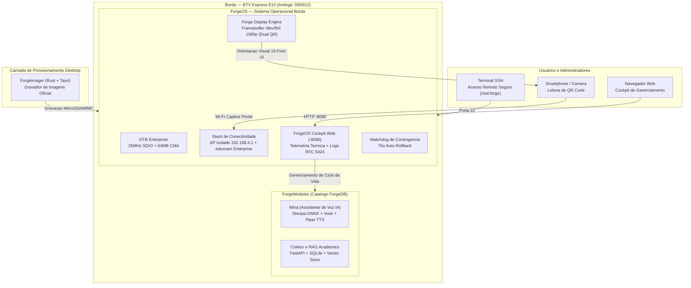
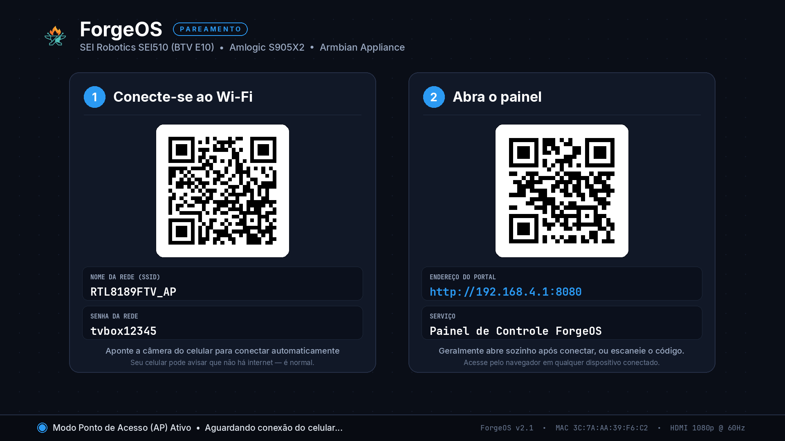
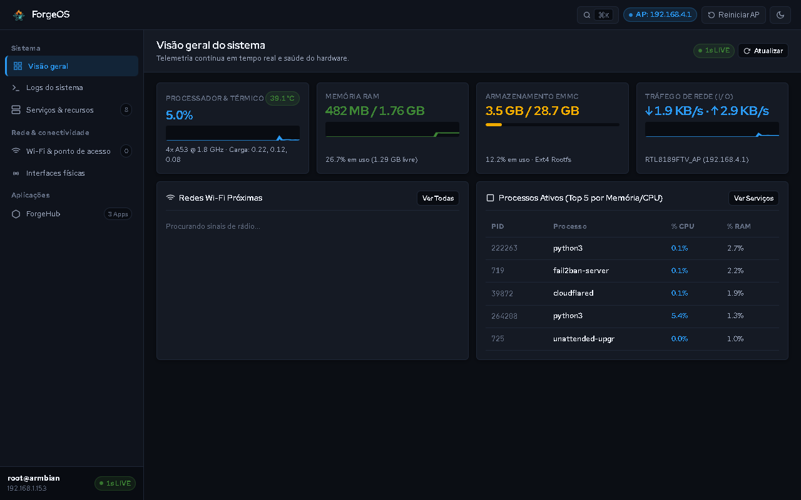
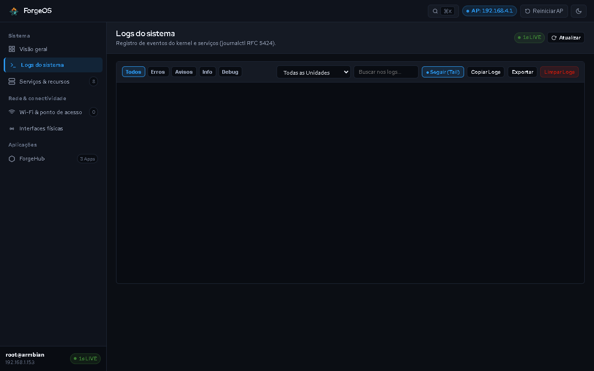
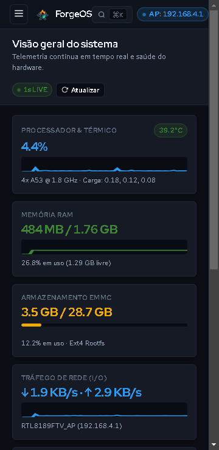

<p align="center">
  
</p>

# Equipe 1 — MultiForge: Ecossistema Modular e Sistema Operacional para TV Box BTV E10

> 1º Hackathon TV Box Unesp Sorocaba  
> Transformando hardware apreendido em infraestrutura educacional, totens inteligentes de IA e servidores de alta eficiencia.

---

## Membros da Equipe 1
* Brenda Biral
* Adriel Henrique Souza
* Isaac Andrade
* Luiz Antonio
* Marcos Oliveira E Silva
* Rafael de Sa Mascarenhas

---

## Visao Geral do Projeto

O MultiForge e uma solucao completa de engenharia de software e firmware desenvolvida especificamente para descaracterizar, otimizar e reaproveitar aparelhos BTV Express E10 (Amlogic S905X2) apreendidos em operacoes da Receita Federal e ANATEL.

Em vez de criar uma aplicacao isolada, a Equipe 1 desenvolveu um ecossistema em 4 camadas composto por:
1. ForgeOS: Uma distribuicao Linux Armbian customizada e enxuta, com DTB Enterprise compilada sob medida (resolvendo o clock de 25MHz e 64MB CMA do Wi-Fi RTL8189FTV), interface de pareamento HDMI Framebuffer 1080p sem dependencia de X11 e Portal Cativo de provisionamento responsivo.
2. ForgeDB: O catalogo central e schema de validacao que define as capacidades de hardware e registra os manifestos de ciclo de vida dos modulos.
3. ForgeModules: Modulos funcionais desacoplados prontos para uso:
   - Mina — Assistente Virtual Academica: Quiosque inteligente de voz operando 100% offline na borda com ONNX, deteccao de intencoes e sintese de voz para atendimento no ICT Unesp.
   - Coletor Academico e Agente RAG: Pipeline assincrono de coleta e indexacao de dados universitarios com FastAPI, LangChain e SQLite.
4. ForgeImager: Aplicativo desktop multiplataforma moderno (construido em Rust + Tauri + React) para gravacao automatizada da ISO no MicroSD/eMMC com verificacao criptografica SHA-256.

---

## Arquitetura do Sistema



---

## Capturas de Tela do Sistema em Producao Real

| 1. Painel HDMI Framebuffer 1080p (/dev/fb0) | 2. Cockpit Web (Telemetria Termica e Recursos) |
| :---: | :---: |
|  |  |

| 3. Visualizador de Logs RFC 5424 em Tempo Real | 4. Responsividade Mobile do Portal Cativo |
| :---: | :---: |
|  |  |

---

## Estrutura de Diretorios da Equipe 1

```
Projeto Equipe 1/
├── README.md               # Documentacao principal do projeto
├── ForgeOS/                # Stack do Sistema Operacional
│   ├── bin/                # Scripts de ciclo de vida (start-ap, wifi-connect, reset)
│   ├── display/            # Motor grafico do display HDMI (/dev/fb0) e fontes
│   ├── distro/             # Pipeline de compilacao da imagem ISO e GCP Spot VM Launcher
│   ├── network/            # Gestores de rede WPA2 Personal e WPA-Enterprise (eduroam)
│   ├── systemd/            # Servicos da stack (portal, ap, display, watchdog)
│   ├── tests/              # Suites de testes unitarios e de integracao
│   └── web/                # Portal Web Cockpit (HTML5/CSS3/JS puro com tabulacao e SVG)
├── ForgeModules/           # Modulos Funcionais Prontos
│   ├── totem/              # Modulo Mina: Assistente Virtual de Voz Academica
│   └── sub-modulos/        # Modulo Coletor Academico e RAG Agent
├── ForgeDB/                # Catalogo de Hardware e Schemas de Modulos
│   ├── devices/btv/e10/    # DTS/DTB Enterprise e especificacoes de hardware
│   ├── modules/            # Manifestos YAML dos modulos
│   └── schemas/            # Schemas JSON para validacao
├── ForgeImager/            # Gravador Desktop Multiplataforma (Tauri + Rust)
│   ├── src/                # Interface React / TypeScript
│   ├── src-tauri/          # Motor nativo em Rust para gravacao de disco
│   └── crates/             # Utilitarios de baixo nivel (forge-write-conf)
├── docs/                   # Diagramas, relatorios de auditoria e arquitetura
└── imagens/                # Capturas de tela oficiais em alta definicao
```

---

## Destaques de Engenharia e Inovacao

1. Correcao Definitiva do Driver Wi-Fi RTL8189FTV:  
   Em placas BTV E10, o driver padrao do Armbian falha ou apresenta instabilidade devido ao clock incorreto de 50MHz no barramento SDIO. Desenvolvemos o DTB Enterprise (meson-g12a-btv-e10-enterprise.dts) calibrando o clock para 25MHz e alocando 64MB de CMA, garantindo estabilidade ininterrupta em modo Ponto de Acesso e Cliente.
2. Interface 10-Foot UI para HDMI Framebuffer:  
   Renderizador em Python puro com PIL escrevendo diretamente em /dev/fb0 a 1920x1080 @ 60Hz sem necessidade de X11, Wayland ou overhead de memoria. Inclui Dual QR Code (Wi-Fi ZXing + URL Direta) e protecao anti-burn-in por pixel-shift ciclico.
3. Maquina de Estados de Pareamento:  
   Assim que o usuario conclui a configuracao da rede, o display HDMI oculta automaticamente as credenciais do AP temporario e passa a exibir a telemetria do appliance (temperatura da CPU S905X2, uso de RAM, uptime e novo IP na rede local).
4. Portal Cativo com Suporte a WPA-Enterprise / eduroam:  
   Compatibilidade com autenticacao corporativa/universitaria (PEAP/MSCHAPv2) e redes domesticas WPA2-Personal com varredura dinamica via wpa_supplicant.
5. Watchdog de Contingencia (75s Auto-Rollback):  
   Se uma nova configuracao de Wi-Fi falhar ou ficar sem resposta por mais de 75 segundos, o sistema restaura automaticamente o Ponto de Acesso de emergencia.

---

## Como Baixar e Instalar

### 1. Download dos Binarios Oficiais
* Imagem do Sistema Operacional (ISO/IMG):  
  https://github.com/gasiepgodoy/Hackathon-TV-Box-E10/releases/tag/equipe1-v1.1.0
* Gravador Desktop:  
  https://github.com/gasiepgodoy/Hackathon-TV-Box-E10/releases/tag/equipe1-v1.1.0

### 2. Passo a Passo de Execucao
1. Grave o arquivo .img.xz no MicroSD utilizando o ForgeImager ou Raspberry Pi Imager.
2. Insira o cartao na TV Box BTV E10 e ligue o cabo de energia e o cabo HDMI.
3. Aponte a camera do seu celular para o QR Code da tela da TV para conectar ao Wi-Fi RTL8189FTV_AP (senha: tvbox12345).
4. Abra o navegador em http://192.168.4.1:8080 e selecione a sua rede Wi-Fi.
5. Para acesso administrativo via terminal:  
   ssh root@192.168.4.1 (Senha padrao: forge).

---

## Licenca e Propriedade Intelectual

Desenvolvido para o 1º Hackathon TV Box Unesp Sorocaba (2026) sob licenca de codigo aberto MIT.
