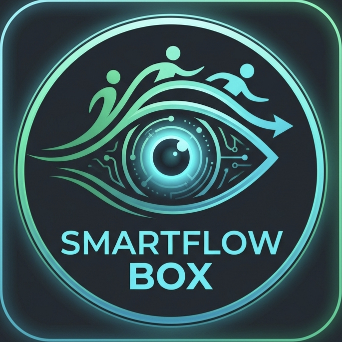

  

  # SmartFlow Box

  **Monitoramento de Filas e Fluxo de Atendimento via Visão Computacional em Dispositivos Embarcados**

  
  
  
  

---

### 👥 Membros da Equipe (Equipe 5)

* **Bryan Xavier Kufta**
* **Guilherme Henrique Pinheiro**
* **Vinicius Gabriel Barros**

---

## 📌 Sobre o Projeto

* **A Solução:** O **SmartFlow Box** é uma solução de visão computacional projetada para operar em hardware restrito (como TV Boxes/SBCs rodando Linux). O sistema monitora e analisa o fluxo de pessoas em tempo real.
* **O Objetivo:** Calcular e exibir o tempo estimado de espera combinando a contagem de pessoas na fila com o ritmo e número de atendentes em serviço.
* **Para que serve:** Detectar a presença de usuários e funcionários em áreas delimitadas (ROIs), automatizando as métricas de tempo e vazão do local.
* **Aplicação Principal:** Gestão inteligente de filas de atendimento, validada e aplicada no **Restaurante Universitário (RU)** para otimizar o tempo dos estudantes e mitigar congestionamentos nos horários de pico.

---

## 🛠️ Tecnologias Utilizadas e Arquitetura

* **Python 3.10+**: Linguagem base escolhida pela maturidade do ecossistema de dados e integração nativa com bibliotecas de visão computacional.
* **YOLOv8 (Formato ONNX)**: Modelo de redes neurais profundas pré-treinado para detecção de objetos. O modelo foi convertido de PyTorch para **ONNX (Open Neural Network Exchange)** para reduzir o overhead de memória e permitir inferências rápidas rodando apenas em CPU embarcada.
* **OpenCV (DNN & Stream MJPEG)**: Atua no carregamento da rede ONNX via `cv2.dnn`, desenho das caixas delimitadoras (*bounding boxes*), pré-processamento de frames do vídeo e codificação das imagens em formato MJPEG para streaming em tempo real.
* **Flask**: Servidor web *lightweight* responsável por gerenciar a pipeline de vídeo, fornecer as APIs REST para recebimento de coordenadas e servir o dashboard HTML.
* **Shapely**: Utilizada para cálculos de geometria computacional. Permite determinar se o ponto central da base da caixa de detecção de uma pessoa (*bottom-center*) está contido dentro dos polígonos das Regiões de Interesse (ROIs).
* **SQLite3**: Banco de dados relacional embutido e sem necessidade de servidor separado, garantindo a escrita eficiente do histórico de ocupação por intervalos de tempo sem consumir recursos excessivos do sistema.
* **Chart.js & HTML5 Canvas**: Responsáveis pela renderização interativa do dashboard web, exibindo a transmissão do vídeo em tempo real e gráficos dinâmicos atualizados por requisições assíncronas.
* **pytz**: Garante que os carimbos de data/hora (*timestamps*) gravados no banco de dados reflitam o fuso horário oficial local (`America/Sao_Paulo`), prevenindo inconsistências no histórico.

---

## 📁 Estrutura do Repositório

<pre><code>Projeto Equipe 5/
├── static/
│   └── logo.png         # Logotipo do projeto exibido no cabeçalho do dashboard
├── templates/
│   └── index.html       # Dashboard responsivo com Player HTML5/Canvas e Gráficos
├── main.py              # Servidor Flask, Thread da IA e Lógica das ROIs
├── requirements.txt     # Lista de dependências Python
├── yolov8n.onnx         # Modelo YOLOv8 otimizado para inferência rápida via OpenCV DNN
├── yolov8n.pt           # Pesos originais do YOLOv8 (PyTorch)
├── README.md            # Documentação oficial do projeto
├── (config_roi.json)    # Gerado dinamicamente ao marcar as ROIs pela interface web
└── (banco_dados.db)     # Banco SQLite criado automaticamente na primeira execução</code></pre>

---

## 🚀 Como Executar (Passo a Passo Detalhado)

### 1. Sincronizar Fuso Horário do Sistema (Linux)
Garante que todas as métricas salvas pelo SQLite utilizem o fuso horário brasileiro para não des alinhar os gráficos históricos:
`timedatectl set-timezone America/Sao_Paulo`  
`localectl set-locale LC_TIME=pt_BR.UTF-8`

### 2. Configurar e Ativar o Ambiente Virtual Python (venv)
Isola as bibliotecas do projeto do Python do sistema operacional, evitando conflitos entre dependências do Linux e módulos Python:
`python3 -m venv venv`  
`source venv/bin/activate`

### 3. Instalar Dependências
Instala todas as bibliotecas necessárias declaradas no `requirements.txt` (OpenCV, Flask, Shapely, pytz, etc.):
`pip install -r requirements.txt`

### 4. Iniciar a Aplicação
Carrega o modelo ONNX na memória, inicia a captura do vídeo e sobe o servidor web na porta 5000:
`python main.py`

---

## 🖥️ Como Utilizar a Interface Web

1. **Acesso:** Acesse o painel pelo navegador em qualquer dispositivo na mesma rede local: `http://<IP_DO_DISPOSITIVO>:5000`.
2. **Marcação da ROI da Fila (Contorno Vermelho):**
   * Clique no botão **Marcar ROI Fila (Vermelho)**.
   * Clique em 4 pontos sobre a área do vídeo para formar um polígono. A interface envia coordenadas normalizadas (0.0 a 1.0) para garantir precisão independentemente da resolução de tela.
3. **Marcação da ROI de Atendimento (Contorno Amarelo):**
   * Clique no botão **Marcar ROI Atendimento (Amarelo)**.
   * Clique em 4 pontos no vídeo demarcando o local onde os atendentes permanecem.
4. **Interpretação Visual:**
   * **Verde:** Pessoas contabilizadas na Fila.
   * **Laranja:** Pessoas contabilizadas no Atendimento.
   * **Azul:** Pessoas fora das zonas monitoradas.
5. **Ações de Gerenciamento:**
   * **Limpar ROIs:** Reseta os limites configurados e apaga o arquivo `config_roi.json`.
   * **Zerar Histórico:** Limpa a tabela do banco de dados do dia atual.
   * **Análise Histórica:** Alterne os dias no painel para comparar horários de pico e médias do fluxo de pessoas.
