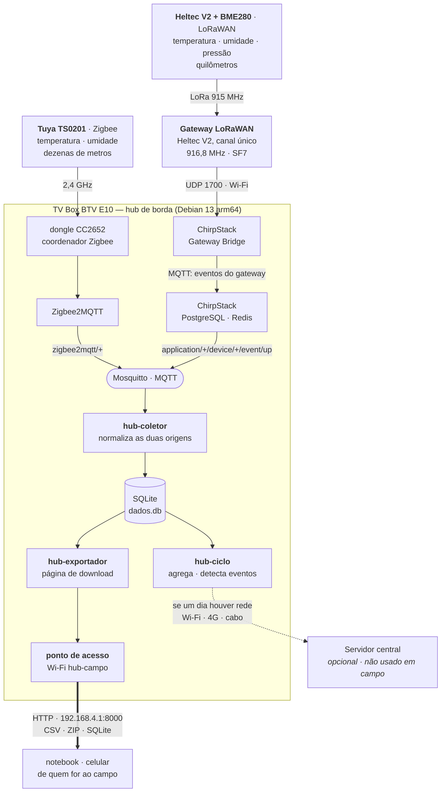
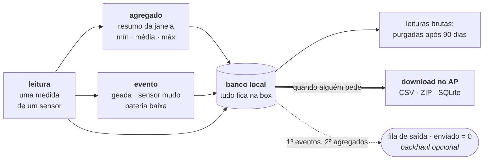

<p align="center">
  <picture>
    <source media="(prefers-color-scheme: dark)" srcset="assets/logo-dark.svg">
    
  </picture>
</p>

# Equipe 6 — EdgeVision: Hub de sensores para áreas isoladas

**Equipe:** Guilherme Lobo Teixeira, Julia Machado de Mello

## Resumo

O EdgeVision monitora clima e eventos em áreas sem infraestrutura de rede, com
custo baixo por ponto de medição: uma TV Box reaproveitada vira gateway
multiprotocolo de borda, recebe sensores próximos por Zigbee e distantes por
LoRaWAN, grava tudo num banco local, calcula médias, mínimas e máximas e detecta
eventos críticos — **tudo dentro da própria box, sem nuvem e sem internet**. Para
levar os dados embora, a box publica a própria rede Wi-Fi e serve uma página de
download: qualquer notebook ou celular conectado nela baixa os dados pelo
navegador, no meio do mato, sem instalar nada. A aplicação principal é agrícola:
alerta de geada em pomares e estufas, onde vinte minutos de frio decidem a safra.
A mesma base serve ao monitoramento ambiental: microclima de mata, nascentes e
áreas de preservação.

## Estrutura

- [`src/hub/`](src/hub/) — módulos do hub: coletor, agregador, eventos, enviador, exportador, CLI
- [`sql/schema.sql`](sql/schema.sql) — esquema do banco, índices e a view de inspeção
- [`systemd/`](systemd/) — serviços do coletor e do exportador, timers do ciclo e da purga
- [`config/`](config/) — arquivo de configuração de exemplo
- [`node-red/`](node-red/) — dashboard de visualização e teste, com [instruções próprias](node-red/README.md)
- [`tests/`](tests/) — 41 testes, sem dependências externas
- [`docs/arquitetura.md`](docs/arquitetura.md) — decisões e alternativas descartadas
- [`assets/`](assets/) — logotipo (versões clara, escura e só o símbolo)

## Arquitetura



O traço grosso é como os dados saem **hoje**: puxados pelo navegador, na rede
Wi-Fi que a própria box publica. Não há servidor central em campo e nem se espera
um — o banco da box é a fonte da verdade, e o dado chega a quem precisa dele numa
rede que não sai do terreno.

O pontilhado é o caminho inverso, de **empurrar** para um servidor. Está
preparado no código (fila, ordem de prioridade, flags `enviado`, tudo testado),
mas sem transporte final implementado. É uma extensão, não uma dependência: nada
no sistema para de funcionar por ele não existir.

O gateway LoRaWAN é uma **segunda placa Heltec, fora da box**: ela recebe o rádio
dos nós e repassa os pacotes por Wi-Fi (UDP 1700), conectada ao ponto de acesso
`hub-campo` que a própria box publica em `192.168.4.1`. Rádio e processamento
ficam separados, e trocar o concentrador não mexe em nenhuma linha de software.

A escolha de dois protocolos é econômica: sensores Zigbee são baratos porque não
carregam rádio de longo alcance, e cobrem bem uma área concentrada. Onde a
distância inviabiliza o Zigbee, entram nós LoRaWAN — mais caros por unidade, mas
poucos e cobrindo quilômetros. A TV Box concentra os dois.

### Onde a coleta roda

Toda a coleta e todo o processamento acontecem **dentro da TV Box**, como
serviços do systemd. Não há nuvem, VPS, container remoto nem serviço de terceiro
no caminho: a box liga, os serviços sobem sozinhos e o sistema volta a registrar
sem ninguém intervir — inclusive depois de uma queda de energia, que em campo é
o normal, não a exceção.

| Serviço | O que faz | Quando roda |
|---|---|---|
| `hub-coletor` | assina o MQTT, normaliza Zigbee e LoRa, grava no SQLite | contínuo |
| `hub-ciclo` | fecha janelas, calcula agregados, detecta eventos | a cada 5 min |
| `hub-purga` | apaga leituras brutas com mais de 90 dias | diário |
| `hub-exportador` | serve a página de download no AP | contínuo |

Na mesma box, dando suporte: Mosquitto (o MQTT onde as duas origens se
encontram), Zigbee2MQTT (com o dongle CC2652) e ChirpStack (servidor de rede
LoRaWAN). Fora da box ficam só os rádios — os sensores Zigbee, os nós LoRa e o
gateway LoRaWAN. Nenhum deles processa nada: apenas transmitem.

O banco fica em `/var/lib/hub/dados.db` e a configuração em `/etc/hub/hub.ini`.

### O caminho de um dado



Nada é descartado por não ter para onde ir: leitura, agregado e evento vão todos
para o mesmo banco, e ficam lá até alguém buscar. A diferença entre eles aparece
na **hora de exportar** — o agregado é o que quase todo mundo quer, porque as
leituras brutas são muitas e pouco informativas depois de resumidas, e o evento é
o que se olha primeiro, porque é raro, pequeno e urgente.

Essa ordem de prioridade também é a da fila de saída, para o dia em que existir
um servidor central. Hoje ela só acumula — e é de propósito: exportar não a
consome, então ela permanece íntegra.

**Por que o gateway fica na box.** Em campo, a área monitorada costuma ser
isolada, mas o ponto onde se instala o hub geralmente não é — uma propriedade
rural tem a sede com energia e alguma conectividade, enquanto os talhões ficam a
quilômetros. Colocar o gateway LoRaWAN junto ao hub é a topologia usada em
implantações comerciais de agricultura. Detalhes e alternativas descartadas em
[docs/arquitetura.md](docs/arquitetura.md).

## Hardware

Esta é a lista do que **usamos nos testes** — não é uma lista de requisitos:

| Papel | Equipamento usado |
|---|---|
| Hub de borda | TV Box BTV E10 (Amlogic S905X2, 1,8 GB RAM), Debian 13 arm64 |
| Coordenador Zigbee | Dongle USB CC2652 (Z-Stack 3.x.0), conversor CH340 |
| Sensores Zigbee | Tuya TS0201 — temperatura e umidade, a pilha |
| Gateway LoRaWAN | Heltec WiFi LoRa 32 V2, canal único, 916,8 MHz |
| Nós LoRa | Heltec WiFi LoRa 32 V2 (915 MHz) + BME280 |

**O sistema não conhece nenhuma dessas peças.** O hub conversa com sensores pelo
MQTT, não com hardware: o que ele entende são tópicos e JSON. Na prática isso
significa que

- **qualquer sensor que o Zigbee2MQTT reconheça** entra sem tocar no código — são
  milhares de modelos de dezenas de fabricantes. Escolhemos o TS0201 por ser
  barato e funcionar a pilha, não por alguma afinidade do software com ele;
- **qualquer nó LoRaWAN registrado no ChirpStack** que envie JSON é aceito, com o
  sensor que for: um DHT22, um sensor de umidade de solo, um pluviômetro. O
  BME280 aparece no código apenas como a origem do campo `pressao`, que é opcional;
- **a TV Box pode ser outra coisa.** É Python 3 da biblioteca padrão sobre Debian
  arm64 — roda igual num Raspberry Pi, num mini-PC x86 ou noutra box. A escolha
  da BTV E10 é o ponto do projeto: reaproveitar hardware ocioso e barato;
- **o gateway de canal único pode virar um de 8 canais** (SX1302, tipo RAK2287)
  sem alterar uma linha. É o que uma implantação real usaria.

Trocar qualquer item acima muda o custo e o alcance, não a arquitetura. O que
definimos foi o formato dos dados e o caminho que eles percorrem — a peça que
entrega a medida é substituível por natureza.

## Por que SQLite

Roda dentro do próprio processo, sem daemon consumindo a RAM escassa da box, e o
banco inteiro é um arquivo — o que torna viável oferecer o banco completo como
download (com a ressalva do WAL, explicada em *Levar os dados embora*). O volume
é pequeno: mesmo com dezenas de sensores em intervalos curtos, fica na casa de
poucas centenas de MB por ano, algo trivial para o SQLite.

## O que a box guarda

| O quê | Por quanto tempo | Por quê |
|---|---|---|
| Leituras brutas | 90 dias, depois purgadas | crescem sem parar e ocupam o cartão |
| Agregados por janela | para sempre | 24 linhas por sensor por dia: cabem |
| Eventos (geada, sensor mudo, bateria) | para sempre | são raros e é o que se quer revisitar |

Tudo isso fica disponível para download enquanto estiver no banco. A agregação
aqui **não existe para economizar link** — não há link. Ela existe para responder
à pergunta que interessa sem obrigar ninguém a abrir milhares de linhas no Excel:
qual foi a mínima da madrugada.

Os agregados guardam **mínimo e máximo**, não só a média: uma geada de 20 minutos
desaparece numa média horária, e é exatamente o evento que o projeto quer captar.

## Sobre a frequência dos sensores

O que segue vale para os **dois modelos que testamos**; com outro hardware os
números mudam, mas o raciocínio é o mesmo. Eles têm características opostas, e
isso afeta a configuração:

**Tuya TS0201 (Zigbee) — intervalo fixo, não configurável.** A definição no
Zigbee2MQTT tem `toZigbee: []` e um `configure` que só envia o *magic packet*,
sem `configureReporting`. Não há canal para alterar o intervalo; ele está cravado
no firmware. O sensor reporta por mudança de valor e periodicamente — o que ajuda
em eventos rápidos, mas produz poucas amostras em ambiente estável.

**BME280 (LoRa) — intervalo configurável no firmware do nó.** Aqui você decide a
cadência, equilibrando resolução contra autonomia de bateria e tempo de ar. O
valor está na constante `TX_INTERVAL` do sketch do nó, hoje 60 s.

O nó envia JSON com chaves de uma letra, por exemplo:

```json
{"t":22.4,"h":58.1,"p":1009.5}
```

São 30 bytes. Com os nomes por extenso seriam 54, acima do limite de 51 bytes do
AU915 em DR0 — o pacote seria descartado justamente quando o enlace está pior. O
coletor aceita as duas formas.

Se o BME280 não responder, o nó transmite `{"err":"bme280"}`. O hub recusa a
leitura, mas o pacote continua visível no `hub espiar` — é o que distingue
*sensor quebrado* de *nó fora do alcance*, que no silêncio total seriam idênticos.

Como consequência, **a janela de agregação deve ser ajustada por origem**. Meça o
intervalo real antes de definir:

```sql
SELECT ts - LAG(ts) OVER (ORDER BY ts) AS segundos
FROM leituras WHERE sensor_id = 1 ORDER BY ts DESC LIMIT 20;
```

Ajuste `janela_s` para que cada janela contenha ao menos 6 amostras. Se um sensor
reportar mais devagar que isso, agregá-lo não traz ganho — use as leituras brutas
direto, que a exportação também entrega.

## Instalação

Requer apenas Python 3 e `mosquitto-clients` — nenhuma dependência via pip.

```bash
sudo cp -r . /opt/hub-sensores
sudo mkdir -p /etc/hub /var/lib/hub
sudo cp config/hub.example.ini /etc/hub/hub.ini
sudo cp systemd/* /etc/systemd/system/
sudo systemctl daemon-reload
sudo systemctl enable --now hub-coletor.service hub-ciclo.timer hub-purga.timer
sudo systemctl enable --now hub-exportador.service
```

Para a origem LoRa é preciso também o ChirpStack e o Gateway Bridge na box; para
a origem Zigbee, o Zigbee2MQTT. O hub em si não depende de nenhum dos dois — ele
só assina os tópicos que existirem.

O dashboard de visualização é **opcional** e tem instalação própria, porque pesa
uns 100–150 MB de RAM e nem sempre compensa deixá-lo ligado: veja
[node-red/README.md](node-red/README.md).

⚠️ A TV Box vem **sem swap**. Antes de subir a pilha do ChirpStack (que traz
PostgreSQL e Redis junto), crie uma área de troca — sem ela, qualquer pico de
memória aciona o OOM killer sem aviso, e foi assim que o Zigbee2MQTT entrou em
laço de reinício durante o desenvolvimento:

```bash
sudo fallocate -l 2G /swapfile && sudo chmod 600 /swapfile
sudo mkswap /swapfile && sudo swapon /swapfile
echo '/swapfile none swap sw 0 0' | sudo tee -a /etc/fstab
```

## Uso

```bash
export PYTHONPATH=/opt/hub-sensores/src HUB_CONFIG=/etc/hub/hub.ini

python3 -m hub.cli status          # visão geral, com a quebra por origem
python3 -m hub.cli leituras -n 20  # últimas leituras
python3 -m hub.cli pendentes       # fila do backhaul opcional (ver Integração do transporte)
python3 -m hub.cli espiar          # diagnóstico: o que passa no MQTT e por que é aceito
python3 -m hub.cli nomear sensor_01 "Estufa Norte" --local "Setor A"
```

O `espiar` é a ferramenta de depuração principal: mostra cada mensagem que chega
ao broker — das duas origens — e, quando descartada, **o motivo exato**.

## Levar os dados embora

**Toda a transmissão é local.** Nada sai do terreno: nenhum dado vai para a
internet, para nuvem ou para servidor de terceiro — nem precisa, porque em campo
não há conectividade para isso. A própria box publica uma rede Wi-Fi
(`hub-campo`) e serve os dados nela. Quem for até lá conecta o celular ou o
notebook nessa rede, como se conectaria em qualquer Wi-Fi, e abre no navegador:

```
http://192.168.4.1:8000
```

A consequência prática é que **funciona com a box desligada do mundo**: sem chip,
sem operadora, sem depender de sinal. E a transferência é rápida porque é Wi-Fi
local — baixar meses de leituras leva segundos, não o que levaria por 4G rural.

Sem instalar nada, sem SSH, sem pen drive. A página mostra quantos sensores,
quantas leituras e há quanto tempo foi a última — antes de baixar, já dá para
ver se a box estava mesmo coletando — e oferece três escolhas:

| Download | O que vem | Para quem |
|---|---|---|
| **Somente agregados** (`.csv`) | mín, máx e média por janela | é o que quase todo mundo quer |
| **Todos os dados** (`.zip`) | um CSV por tabela: leituras, agregados, eventos, sensores | análise completa |
| **Banco completo** (`.db`) | cópia consistente do SQLite | quem quer consultar com SQL |

Os CSV saem em UTF-8 **com BOM**, separador `;` e vírgula decimal: o dialeto que
o Excel em português abre sem perguntar nada. Com vírgula como separador, o
arquivo abriria com todas as colunas empilhadas na primeira — e sem BOM os
acentos viram `Análise`. Cada tabela traz o tempo em duas colunas, o epoch para
processar e a data local para ler.

O download do banco inteiro **não** é uma cópia do arquivo: o schema usa
`journal_mode = WAL`, então as transações mais recentes vivem no `-wal`, fora do
`.db`. Copiar o `.db` sozinho entregaria um banco sem as últimas leituras —
justamente as que interessam numa demonstração. O exportador usa a API de backup
online do SQLite, que tira um snapshot coerente sem parar o coletor.

Exportar é leitura pura: não mexe nas flags `enviado`. Baixar um CSV não consome
a fila do backhaul.

⚠️ O serviço escuta **só no IP do AP** (`192.168.4.1`), e isso é deliberado. A
box também tem IP público da universidade; com `0.0.0.0` o banco de sensores
ficaria exposto na internet, sem autenticação. O detalhe é traiçoeiro porque no
AP as duas configurações funcionam igual — o teste passa nos dois casos. Mesmo
assim, no AP não há senha: quem estiver conectado ao `hub-campo` baixa tudo.

## As duas origens de dados

O coletor assina dois padrões de tópico e normaliza tudo para o mesmo formato:

| Origem | Tópico | Grandezas | Sinal |
|---|---|---|---|
| Zigbee2MQTT | `zigbee2mqtt/<nome>` | temperatura, umidade | LQI (0–255) |
| ChirpStack | `application/+/device/+/event/up` | temperatura, umidade, pressão | RSSI (dBm) |

Nos uplinks LoRaWAN, o coletor usa o campo `object` quando há um **codec**
configurado no Device Profile do ChirpStack. Sem codec, ele decodifica o `data`
em base64 e tenta interpretá-lo como JSON — que é o formato que o firmware do nó
envia hoje. Se o payload for binário, o `espiar` avisa que falta configurar o
codec.

A coluna `sensores.transporte` registra a origem (`zigbee` ou `lora`), o que
permite calibrar limiares por tipo — os dois têm cadências muito diferentes.

## Demonstração

Sem esperar horas de dados reais:

```bash
export HUB_DB=/tmp/demo.db PYTHONPATH=src

python3 -m hub.simular --horas 12        # gera histórico com uma geada
python3 -m hub.ciclo                     # agrega, detecta eventos, envia
python3 -m hub.cli pendentes

# A prova de resiliência: derruba o enlace, mostra a fila crescendo, religa
python3 -m hub.simular --horas 2
python3 -m hub.ciclo --transporte offline   # nada sobe, nada se perde
python3 -m hub.cli pendentes
python3 -m hub.ciclo --max 100              # enlace volta: a fila esvazia

# A página de exportação, sem precisar da box:
python3 -m hub.exportador --endereco 127.0.0.1 --porta 8000
```

## Testes

```bash
python3 tests/test_hub.py
```

## Cuidados com o cartão SD

Cartões SD morrem por escrita, e banco de dados escreve o tempo todo. As
proteções aplicadas:

- **WAL + `synchronous=NORMAL`** — menos escrita física, mantendo durabilidade
  contra queda de processo;
- **gravação em lote** — as leituras se acumulam em memória e vão ao disco a cada
  20 registros ou 5 minutos, o que reduz de milhares para centenas as escritas
  diárias (o buffer é descarregado no desligamento, então nada se perde);
- **retenção** — leituras brutas com mais de 90 dias são apagadas; agregados são
  mantidos para sempre, pois são muito menores.

O ChirpStack, que roda na mesma box, traz um PostgreSQL junto — e ele escreve bem
mais que o SQLite. É um custo aceito porque a carga dele é o **estado da rede
LoRaWAN** (alguns dispositivos e seus contadores de quadro), que não cresce com o
tempo. A série temporal dos sensores, essa sim sem fim, é o que fica no SQLite.

## Integração do transporte

Há dois caminhos para o dado sair da box, e eles resolvem problemas diferentes.

**Puxar** é o que está em uso: o exportador serve a página no AP e quem quiser
baixa (ver *Levar os dados embora*). Não precisa de servidor do outro lado, nem
de internet, nem de endereço fixo — e é por isso que é a rota que funciona em
campo.

**Empurrar** é o que `enviador.py` prepara, para quando existir um servidor
central: as flags `enviado` são a fila, os eventos saem na frente dos agregados,
e nada é marcado como entregue sem confirmação do transporte. Hoje existem
`TransporteLog`, `TransporteMQTT` e `TransporteIndisponivel` (que simula queda,
para a demonstração); falta um `TransporteHTTP`.

Uma ressalva para quem for escrever esse transporte: **não reaproveite
`empacotar_agregado`**. Aquele empacotamento binário é herança do desenho
original, em que o próprio LoRa seria o backhaul — foi dimensionado para os 51
bytes do DR0 e é lesivo de propósito: umidade cai para `uint8`, o timestamp perde
o segundo, o `sensor_id` é truncado em 1 byte, e `umid_min`, `umid_max`,
`press_media` e `amostras` sequer entram. Sobre um enlace IP isso é dano
gratuito; serialize as linhas direto.

## Limitações conhecidas

- **Gateway de canal único.** Com uma Heltec como concentrador, os nós precisam
  ficar fixos em um canal e usar ABP em vez de OTAA, e os downlinks são pouco
  confiáveis. Uma implantação real usaria um concentrador de 8 canais (SX1302).
  A troca é de hardware; a arquitetura de software não muda.
- **Intervalo dos TS0201 não é ajustável** (ver seção acima).
- **A página de exportação não tem autenticação.** Quem estiver conectado ao
  `hub-campo` baixa tudo. A rede fechada é o controle de acesso; num ambiente com
  gente estranha por perto, troque a senha do AP ou desligue o serviço fora da
  coleta.
- **O transporte para um servidor central não está implementado.** A fila, a
  ordem de prioridade e as flags estão prontas e cobertas por testes; o que falta
  é o `TransporteHTTP`. Não é uma pendência do sistema em campo — lá os dados
  saem pela exportação local —, e sim o que habilitaria vários hubs reportando a
  um painel único.
