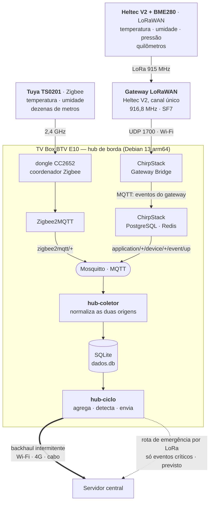
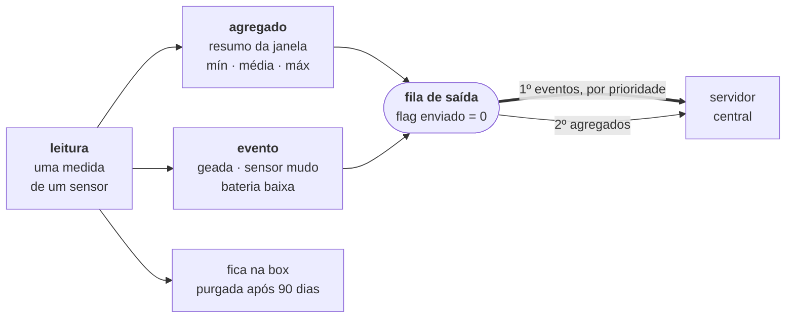

# Equipe 6 — EdgeVision: Hub de sensores para áreas isoladas

Transforma uma TV Box descaracterizada em um **gateway multiprotocolo de borda**:
concentra sensores próximos por Zigbee e sensores distantes por LoRaWAN, guarda
tudo num banco local, processa na própria borda e sincroniza com um servidor
central quando houver conectividade.

**Equipe:** Guilherme Lobo Teixeira, Julia Machado de Mello

## Estrutura

- [`src/hub/`](src/hub/) — módulos do hub: coletor, agregador, eventos, enviador, CLI
- [`sql/schema.sql`](sql/schema.sql) — esquema do banco, índices e a view de inspeção
- [`systemd/`](systemd/) — serviço do coletor e timers do ciclo e da purga
- [`config/`](config/) — arquivo de configuração de exemplo
- [`tests/`](tests/) — 25 testes, sem dependências externas
- [`docs/arquitetura.md`](docs/arquitetura.md) — decisões e alternativas descartadas

## Arquitetura



O traço cheio até o servidor é o caminho principal; o pontilhado é a rota de
emergência, ainda **prevista e não implementada** — o empacotamento binário
existe e é testado, o rádio de saída não.

O gateway LoRaWAN é uma **segunda placa Heltec, fora da box**: ela recebe o rádio
dos nós e repassa os pacotes por Wi-Fi (UDP 1700), conectada ao ponto de acesso
`hub-campo` que a própria box publica em `192.168.4.1`. Rádio e processamento
ficam separados, e trocar o concentrador não mexe em nenhuma linha de software.

A escolha de dois protocolos é econômica: sensores Zigbee são baratos porque não
carregam rádio de longo alcance, e cobrem bem uma área concentrada. Onde a
distância inviabiliza o Zigbee, entram nós LoRaWAN — mais caros por unidade, mas
poucos e cobrindo quilômetros. A TV Box concentra os dois.

### O caminho de um dado



Leituras brutas não sobem por padrão: são muitas e pouco informativas depois de
resumidas. O que viaja é o agregado — e, na frente dele, o evento, que é raro,
pequeno e urgente.

**Por que o gateway fica na box.** Em campo, a área monitorada costuma ser
isolada, mas o ponto onde se instala o hub geralmente não é — uma propriedade
rural tem a sede com energia e alguma conectividade, enquanto os talhões ficam a
quilômetros. Colocar o gateway LoRaWAN junto ao hub é a topologia usada em
implantações comerciais de agricultura. Detalhes e alternativas descartadas em
[docs/arquitetura.md](docs/arquitetura.md).

## Hardware

| Papel | Equipamento |
|---|---|
| Hub de borda | TV Box BTV E10 (Amlogic S905X2, 1,8 GB RAM), Debian 13 arm64 |
| Coordenador Zigbee | Dongle USB CC2652 (Z-Stack 3.x.0), conversor CH340 |
| Sensores Zigbee | Tuya TS0201 — temperatura e umidade, a pilha |
| Nós LoRa | Heltec WiFi LoRa 32 V2 (915 MHz) + BME280 |

## Por que SQLite

Roda dentro do próprio processo, sem daemon consumindo a RAM escassa da box, e o
banco inteiro é um arquivo — backup é copiar. O volume é pequeno: mesmo com
dezenas de sensores em intervalos curtos, fica na casa de poucas centenas de MB
por ano, algo trivial para o SQLite.

## O que sobe pelo backhaul

| O quê | Quando sobe |
|---|---|
| Eventos (geada, sensor mudo, bateria) | Imediatamente, por prioridade |
| Agregados por janela | Após o fechamento da janela |
| Leituras brutas | Só se houver banda sobrando |

Com backhaul IP (Wi-Fi/4G) não há limite rígido de payload, mas a agregação
continua valendo: em link 4G tarifado ela reduz custo, e se o backhaul cair por
dias a fila não explode. O empacotamento binário de 14 bytes por agregado
permanece implementado para a **rota de emergência por LoRa** — prevista para
quando o backhaul principal está fora e só os alertas críticos precisam sair.

Uma ressalva honesta: o *empacotamento* está pronto e testado, mas o **transporte
final ainda não**. Hoje o enviador entrega em log ou publica num tópico MQTT; o
`TransporteHTTP` para o servidor central e o `TransporteSerial` para o rádio de
emergência são pontos de extensão, não código em produção. Veja
[Integração do transporte](#integração-do-transporte).

Os agregados guardam **mínimo e máximo**, não só a média: uma geada de 20 minutos
desaparece numa média horária, e é exatamente o evento que o projeto quer captar.

## Sobre a frequência dos sensores

Os dois tipos de sensor têm características opostas, e isso afeta a configuração:

**Tuya TS0201 (Zigbee) — intervalo fixo, não configurável.** A definição no
Zigbee2MQTT tem `toZigbee: []` e um `configure` que só envia o *magic packet*,
sem `configureReporting`. Não há canal para alterar o intervalo; ele está cravado
no firmware. O sensor reporta por mudança de valor e periodicamente — o que ajuda
em eventos rápidos, mas produz poucas amostras em ambiente estável.

**BME280 (LoRa) — intervalo configurável no firmware do nó.** Aqui você decide a
cadência, equilibrando resolução contra autonomia de bateria e tempo de ar. O
valor está na constante `TX_INTERVAL` do sketch do nó, hoje 60 s.

O nó envia JSON com chaves de uma letra, por exemplo:

```json
{"t":22.4,"h":58.1,"p":1009.5}
```

São 30 bytes. Com os nomes por extenso seriam 54, acima do limite de 51 bytes do
AU915 em DR0 — o pacote seria descartado justamente quando o enlace está pior. O
coletor aceita as duas formas.

Se o BME280 não responder, o nó transmite `{"err":"bme280"}`. O hub recusa a
leitura, mas o pacote continua visível no `hub espiar` — é o que distingue
*sensor quebrado* de *nó fora do alcance*, que no silêncio total seriam idênticos.

Como consequência, **a janela de agregação deve ser ajustada por origem**. Meça o
intervalo real antes de definir:

```sql
SELECT ts - LAG(ts) OVER (ORDER BY ts) AS segundos
FROM leituras WHERE sensor_id = 1 ORDER BY ts DESC LIMIT 20;
```

Ajuste `janela_s` para que cada janela contenha ao menos 6 amostras. Se um sensor
reportar mais devagar que isso, agregá-lo não traz ganho — envie as leituras
direto.

## Instalação

Requer apenas Python 3 e `mosquitto-clients` — nenhuma dependência via pip.

```bash
sudo cp -r . /opt/hub-sensores
sudo mkdir -p /etc/hub /var/lib/hub
sudo cp config/hub.example.ini /etc/hub/hub.ini
sudo cp systemd/* /etc/systemd/system/
sudo systemctl daemon-reload
sudo systemctl enable --now hub-coletor.service hub-ciclo.timer hub-purga.timer
```

Para a origem LoRa é preciso também o ChirpStack e o Gateway Bridge na box; para
a origem Zigbee, o Zigbee2MQTT. O hub em si não depende de nenhum dos dois — ele
só assina os tópicos que existirem.

⚠️ A TV Box vem **sem swap**. Antes de subir a pilha do ChirpStack (que traz
PostgreSQL e Redis junto), crie uma área de troca — sem ela, qualquer pico de
memória aciona o OOM killer sem aviso, e foi assim que o Zigbee2MQTT entrou em
laço de reinício durante o desenvolvimento:

```bash
sudo fallocate -l 2G /swapfile && sudo chmod 600 /swapfile
sudo mkswap /swapfile && sudo swapon /swapfile
echo '/swapfile none swap sw 0 0' | sudo tee -a /etc/fstab
```

## Uso

```bash
export PYTHONPATH=/opt/hub-sensores/src HUB_CONFIG=/etc/hub/hub.ini

python3 -m hub.cli status          # visão geral, com a quebra por origem
python3 -m hub.cli leituras -n 20  # últimas leituras
python3 -m hub.cli pendentes       # fila aguardando sincronização
python3 -m hub.cli espiar          # diagnóstico: o que passa no MQTT e por que é aceito
python3 -m hub.cli nomear sensor_01 "Estufa Norte" --local "Setor A"
```

O `espiar` é a ferramenta de depuração principal: mostra cada mensagem que chega
ao broker — das duas origens — e, quando descartada, **o motivo exato**.

## As duas origens de dados

O coletor assina dois padrões de tópico e normaliza tudo para o mesmo formato:

| Origem | Tópico | Grandezas | Sinal |
|---|---|---|---|
| Zigbee2MQTT | `zigbee2mqtt/<nome>` | temperatura, umidade | LQI (0–255) |
| ChirpStack | `application/+/device/+/event/up` | temperatura, umidade, pressão | RSSI (dBm) |

Nos uplinks LoRaWAN, o coletor usa o campo `object` quando há um **codec**
configurado no Device Profile do ChirpStack. Sem codec, ele decodifica o `data`
em base64 e tenta interpretá-lo como JSON — que é o formato que o firmware do nó
envia hoje. Se o payload for binário, o `espiar` avisa que falta configurar o
codec.

A coluna `sensores.transporte` registra a origem (`zigbee` ou `lora`), o que
permite calibrar limiares por tipo — os dois têm cadências muito diferentes.

## Demonstração

Sem esperar horas de dados reais:

```bash
export HUB_DB=/tmp/demo.db PYTHONPATH=src

python3 -m hub.simular --horas 12        # gera histórico com uma geada
python3 -m hub.ciclo                     # agrega, detecta eventos, envia
python3 -m hub.cli pendentes

# A prova de resiliência: derruba o enlace, mostra a fila crescendo, religa
python3 -m hub.simular --horas 2
python3 -m hub.ciclo --transporte offline   # nada sobe, nada se perde
python3 -m hub.cli pendentes
python3 -m hub.ciclo --max 100              # enlace volta: a fila esvazia
```

## Testes

```bash
python3 tests/test_hub.py
```

## Cuidados com o cartão SD

Cartões SD morrem por escrita, e banco de dados escreve o tempo todo. As
proteções aplicadas:

- **WAL + `synchronous=NORMAL`** — menos escrita física, mantendo durabilidade
  contra queda de processo;
- **gravação em lote** — as leituras se acumulam em memória e vão ao disco a cada
  20 registros ou 5 minutos, o que reduz de milhares para centenas as escritas
  diárias (o buffer é descarregado no desligamento, então nada se perde);
- **retenção** — leituras brutas com mais de 90 dias são apagadas; agregados são
  mantidos para sempre, pois são muito menores.

O ChirpStack, que roda na mesma box, traz um PostgreSQL junto — e ele escreve bem
mais que o SQLite. É um custo aceito porque a carga dele é o **estado da rede
LoRaWAN** (alguns dispositivos e seus contadores de quadro), que não cresce com o
tempo. A série temporal dos sensores, essa sim sem fim, é o que fica no SQLite.

## Integração do transporte

O envio é plugável. Hoje existem `TransporteLog`, `TransporteMQTT` e
`TransporteIndisponivel` (que simula queda, para a demonstração). Para o backhaul
real, implemente `TransporteHTTP` ou `TransporteSerial` em `enviador.py` — o
resto do sistema não muda.

## Limitações conhecidas

- **Gateway de canal único.** Com uma Heltec como concentrador, os nós precisam
  ficar fixos em um canal e usar ABP em vez de OTAA, e os downlinks são pouco
  confiáveis. Uma implantação real usaria um concentrador de 8 canais (SX1302).
  A troca é de hardware; a arquitetura de software não muda.
- **`enviado` marca transmissão, não recepção.** Sem downlink confiável não há
  ACK fim a fim. Com backhaul IP isso deixa de ser problema.
- **Intervalo dos TS0201 não é ajustável** (ver seção acima).
- **O transporte para o servidor central não está implementado.** A fila, a
  ordem de prioridade e o empacotamento estão prontos e cobertos por testes; o
  que falta é o `TransporteHTTP`. É a próxima peça, não um problema de desenho.
