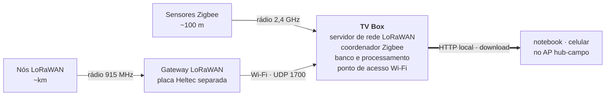

# Decisões de arquitetura

Este documento registra **por que** o sistema é como é, incluindo as alternativas
que foram consideradas e descartadas. A intenção é que outra equipe (ou nós
mesmos daqui a alguns meses) consiga entender os trade-offs sem repetir a
investigação.

## O problema

Monitorar dados climáticos e eventos em áreas isoladas, com dois requisitos em
tensão: **cobrir uma área grande** e **manter o custo por sensor baixo**.

Rádios de longo alcance encarecem cada ponto de medição. Rádios baratos não
alcançam. A solução é hierarquizar: usar o rádio barato onde os sensores estão
concentrados e o caro apenas onde a distância obriga.

## Topologia escolhida: a box como gateway multiprotocolo

A TV Box acumula três papéis: coordenador Zigbee, **servidor de rede LoRaWAN**
(ChirpStack) e computador de borda com banco local.

Vale a distinção, porque confundir os dois é fácil: o *gateway* LoRaWAN — o rádio
que escuta os nós — é uma placa Heltec separada, ligada à box por Wi-Fi. A box
hospeda o *servidor de rede*, que é software. Essa separação é o que permite
trocar o concentrador de canal único por um de 8 canais sem alterar uma linha.

**Por que a rede LoRaWAN fica na borda, e não num servidor remoto.** O isolamento,
na prática, é geográfico e desigual: a área monitorada não tem infraestrutura, mas
o ponto onde se instala o hub geralmente tem. Uma propriedade rural tem a sede com
energia e alguma conectividade — via rádio, 4G ou satélite — enquanto os talhões,
a mata e os açudes ficam a quilômetros de qualquer coisa. Concentrar gateway e
servidor de rede na sede é exatamente como funcionam as implantações comerciais de
LoRaWAN em agricultura.

A consequência prática é que o sistema **não depende de internet em momento
algum**: o nó transmite, o gateway entrega, o ChirpStack decodifica, o coletor
grava e o exportador entrega a quem for buscar — tudo dentro da propriedade, numa
rede que a própria box publica.

## Como o dado sai da box: puxar, não empurrar

A pergunta parecia resolvida — a box sincroniza com um servidor central quando há
conectividade. Ela não estava: **em campo não há servidor central, e não há
conectividade.** Empurrar exige três coisas que a situação não oferece: um
servidor no ar, um endereço estável para alcançá-lo e um link para chegar lá.

A inversão é o que torna o sistema utilizável sem nenhuma das três. A box publica
um ponto de acesso Wi-Fi (`hub-campo`) e serve uma página HTTP nele; quem for ao
local conecta e baixa. O dado não precisa viajar até alguém — a pessoa já está ao
lado do dado.

As implicações que importam:

- **Não há cliente para instalar.** Um aplicativo, um script Python ou um cliente
  MQTT do outro lado seriam três oportunidades de a demonstração falhar no dia. O
  navegador já está em todo celular e notebook.
- **Não há credencial para distribuir.** A rede fechada é o controle de acesso.
  É um controle fraco, e isso está registrado como limitação no README — mas é
  proporcional: quem está fisicamente ao lado do equipamento já podia levar o
  cartão SD embora.
- **A página não referencia nada externo.** Nenhuma fonte, CSS ou ícone de CDN.
  Offline, um `<link>` para fora não deixa a página feia — deixa a página
  pendurada esperando um DNS que não responde.
- **Exportar é leitura pura.** Não toca nas flags `enviado`. Se baixar um CSV
  marcasse registros como enviados, a primeira pessoa a clicar esvaziaria a fila
  de um backhaul futuro.

Empurrar continua fazendo sentido num cenário: vários hubs reportando a um painel
único, com link disponível. Por isso `enviador.py` permanece pronto — fila, ordem
de prioridade e confirmação por transporte. É uma extensão, não uma dependência.

## Alternativas descartadas

### LoRa como backhaul (box transmitindo para um gateway distante)

Foi o desenho inicial, e foi **abandonado**. O motivo é vazão: o LoRa transporta
dezenas de bytes por mensagem, com limites de tempo de ar. Para escoar dados
concentrados de vários sensores, é pouco — e não há como contornar isso
comprimindo mais, porque o limite é regulatório, não de formato.

O que restou dele no código é o empacotamento binário de 14 bytes por agregado,
em `enviador.py`. Ele continua lá porque é o que os transportes atuais usam e
porque documenta o limite de 51 bytes do DR0, mas **não deve ser reaproveitado**
num transporte IP: ele descarta campos de propósito. O comentário no módulo diz
isso explicitamente, para que ninguém o adote por engano achando que é o formato
canônico do projeto.

### Gateway transmitindo dados de aplicação para um cliente

Considerado após a inversão da topologia: se a rede LoRaWAN é nossa, poderia o
transmissor do gateway ser usado para enviar dados a um cliente remoto?

Tecnicamente é possível — na classe A o cliente envia um uplink e o gateway
responde na janela de recepção seguinte; na classe C o cliente escuta
continuamente e pode receber a qualquer momento. Descartado por três razões:

1. **Papel invertido.** No LoRaWAN o gateway é um repetidor de camada física, não
   uma fonte de dados de aplicação.
2. **Competição por tempo de ar.** O mesmo rádio precisa reservar capacidade para
   as tarefas da rede — aceitar joins, confirmar recebimentos, ajustar taxas.
   Gastar esse tempo com dados de aplicação degrada o serviço a todos os nós.
3. **Vazão.** Continua sendo LoRa: dezenas de bytes, poucas mensagens por hora.

Se a box precisar mesmo empurrar dados por LoRa, o correto é usar um **rádio de
nó separado**, não o gateway.

### PostgreSQL, TimescaleDB ou InfluxDB para os dados dos sensores

Descartados por peso. São projetados para escala e concorrência que este projeto
não tem, e cobram isso em RAM — o recurso mais escasso numa box de 1,8 GB que
também roda Zigbee2MQTT e ChirpStack. O SQLite roda em processo, sem daemon, e
dá conta do volume com folga.

Vale registrar a assimetria: **há um PostgreSQL na box**, exigido pelo ChirpStack
para o estado da rede LoRaWAN (dispositivos, sessões, contadores de quadro). Não
é escolha nossa — é requisito do ChirpStack v4. O que a decisão acima evita é
colocar *também* os dados dos sensores lá dentro, que é o volume que cresce sem
parar. O estado do ChirpStack é pequeno e praticamente estático.

## A fila de saída

É a peça que sustenta a promessa de resiliência. Três tabelas carregam uma flag
`enviado` com índice parcial (`WHERE enviado = 0`), de forma que o índice contém
apenas o que está pendente e encolhe conforme os dados sobem.

A ordem de saída é deliberada:

1. **Eventos** — raros, urgentes, pequenos. Uma geada precisa sair em minutos.
2. **Agregados** — resumos por janela, após o fechamento.
3. **Leituras brutas** — só se houver banda sobrando.

O desenho original mirava o gargalo do LoRa, quando o plano era empurrar os dados
para fora. Hoje a fila **não é usada**: os dados saem pela exportação local, e
exportar não a consome. Ela permanece porque é barata (uma coluna e um índice
parcial) e porque é exatamente o que um servidor central exigiria no dia em que
existir — sem ela, seria preciso reprocessar tudo para descobrir o que já foi
entregue.

## Por que guardar mínimo e máximo

Uma média horária esconde eventos curtos. Uma geada de 20 minutos entre leituras
de 10 °C produz uma média que não dispara alarme nenhum — e é justamente esse
evento que o projeto existe para capturar. Por isso os agregados carregam
`temp_min` e `temp_max`, e a detecção de eventos observa a leitura mais recente,
não a média.

## Heterogeneidade dos sensores

Os dois modelos abaixo são os que **usamos nos testes**, não os que o sistema
exige: o hub fala MQTT, então qualquer sensor aceito pelo Zigbee2MQTT ou qualquer
nó registrado no ChirpStack entra sem alteração de código. O que importa aqui não
são estes dois modelos, e sim que eles são opostos o bastante para provar que o
desenho aguenta a variação — foi por isso que os escolhemos.

Os dois têm características opostas, e o sistema precisa acomodar ambos:

| | Tuya TS0201 (Zigbee) | Heltec + BME280 (LoRa) |
|---|---|---|
| Grandezas | temperatura, umidade | temperatura, umidade, pressão |
| Intervalo | fixo, **não configurável** | configurável no firmware |
| Energia | pilha, longa duração | bateria maior ou alimentação |
| Alcance | dezenas de metros | quilômetros |

A impossibilidade de configurar o TS0201 foi verificada na definição do
Zigbee2MQTT: `toZigbee: []` (nenhum comando pode ser enviado ao dispositivo) e
`configure: tuya.configureMagicPacket`, que apenas desperta o sensor sem
configurar relatórios. O intervalo está cravado no firmware.

Consequência prática: **a janela de agregação precisa ser calibrada pela origem**.
Um sensor que reporta a cada hora não se beneficia de agregação horária — nesse
caso é melhor enviar a leitura direto.

## Proteção do cartão SD

Restrição séria: cartões SD morrem por escrita, e o projeto já perdeu um cartão
por corrupção durante o desenvolvimento (além de dois cartões novos que vieram
defeituosos de fábrica, aceitando escrita sem reter dados).

As mitigações estão descritas no README. A mais relevante é a **gravação em
lote**: acumular leituras em memória e gravar a cada 20 registros ou 5 minutos
reduz as escritas diárias de milhares para centenas. O buffer é descarregado no
desligamento, então não há perda.

O ChirpStack roda na box com PostgreSQL e Redis, e o PostgreSQL escreve bem mais
que o SQLite. Isso é aceitável porque a carga dele é o estado da rede LoRaWAN —
alguns dispositivos e seus contadores de quadro —, que não cresce com o tempo. O
que seria inviável é colocar a série temporal dos sensores lá: essa sim cresce
sem parar, e é o motivo de ela viver no SQLite.

## Limite do protótipo

Uma Heltec como concentrador é um **gateway de canal único**: os nós precisam
ficar fixos em um canal e spreading factor, o join OTAA normalmente não funciona
(o JoinAccept é um downlink) e é preciso usar ABP com chaves fixas.

Numa implantação real usa-se um concentrador de 8 canais (SX1302, como RAK2287),
que elimina todas essas restrições. **A troca é de hardware — a arquitetura de
software permanece idêntica.** Vale explicitar isso: saber onde está o protótipo
e onde está o produto é parte do projeto.
