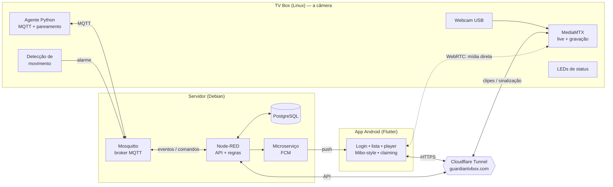

# Equipe 7 — SecBox: Sistema de Segurança com TV Box + App

Projeto do **Hackathon TV Box E10**. Uma **TV Box** (com Linux) faz o papel do equipamento de câmera/alarme e um **aplicativo Android** gerencia os dispositivos remotamente: vídeo ao vivo, gravações, detecção de movimento, notificações e pareamento por QR Code.

> Piloto funcional, validado de ponta a ponta no mundo real.

**Equipe:** Gustavo Henrique Bacci, Rafael Sanchez Nakamura da Silva, Enzo Kawan Da Rocha Vasconcelos, Fernando Toledo de Souza, Leonardo da Silva Paschoal, Victor Thiago Nogueira Ferreira.

## Estrutura do repositório

- [`app/`](app/) — aplicativo Android (Flutter)
- [`tvbox/`](tvbox/) — scripts da borda: câmera (MediaMTX), agente, detecção de movimento, LEDs, remux e serviços systemd
- [`servidor/`](servidor/) — banco de dados (`schema.sql`, `functions.sql`), broker, Node-RED e microserviço de saída (push e e-mail)
- [`monitoramento/`](monitoramento/) — coletor que verifica borda e servidor e reporta o que mudou

---

## Visão geral

Três camadas independentes, comunicando por **MQTT** (controle) e **WebRTC** (vídeo):



**Princípios de projeto**
- **Vídeo nunca passa pelo servidor nem pelo túnel** — vai por WebRTC (ao vivo) e HTTP (gravações), direto da câmera pro app. Pelo túnel passa só a sinalização.
- **`deviceId` + segredo de fábrica** (multi-tenant): cada aparelho tem identidade própria, pertence a um usuário, e o segredo é validado no pareamento.
- **Nenhum segredo compilado no app.** Tudo que ele precisa para falar com a câmera, pede ao servidor provando ser o dono. APK se desmonta.
- **MQTT é o canal de controle entre servidor e borda** — o app não fala MQTT, e por isso o broker nunca precisa ser publicado.

---

## Componentes

### 🎥 Borda — TV Box (Linux, ARM)

| Serviço | Função |
|---|---|
| **MediaMTX** | Captura a webcam (V4L2), serve **WebRTC (ao vivo)**, grava 24/7 no cartão em segmentos, e serve o **playback** das gravações. |
| **Agente** (`agent.py`) | Cliente MQTT: recebe comandos (snapshot, etc.), publica eventos e faz o **modo pareamento** (lê QR pela câmera → conecta Wi-Fi → reivindica o aparelho). |
| **Detecção de movimento** (`motion.py`) | Analisa o stream em baixa resolução (diferença entre quadros) e publica evento de `alarme` ao detectar movimento. |
| **Remux de clipes** (`clip-server.py`) | Converte, sob demanda, o trecho pedido de gravação (fMP4) para MP4 navegável — resolve a linha do tempo com seek no app. |
| **LEDs de status** (`leds.py`) | Controla os LEDs bicolor do painel via GPIO: verde = ok, vermelho = problema/alarme, piscando = pareamento. |
| **Watchdog do SD** | Apaga gravações antigas por espaço livre, evitando encher o disco. |

### 🖥️ Servidor — Debian

| Serviço | Função |
|---|---|
| **Mosquitto** | Broker MQTT (transporte de comandos, eventos e telemetria). |
| **PostgreSQL** | Usuários, dispositivos (com dono/`owner_id`), eventos, sessões e tokens de pareamento. |
| **Node-RED** | Regras e a **API HTTP** do app: `login`, lista de dispositivos, eventos, geração de token de claim, presença (online/offline) e disparo de push. |
| **Microserviço FCM** | Envia as notificações push (Firebase Cloud Messaging) quando um alarme dispara. |

### 📱 App — Flutter (Android) — código em [`app/`](app/)

- **Login** com autenticação (senha com hash bcrypt, sessão persistida).
- **Lista de dispositivos** do usuário (online/offline em tempo real).
- **Player unificado estilo Mibo**: uma tela com ao vivo + gravações numa **régua de tempo por data** (arrastar para navegar), com **zoom**, marcação dos **períodos offline**, marcadores de **movimento**, velocidade de reprodução e tela cheia.
- **Snapshot** e **histórico de eventos**.
- **Adicionar dispositivo por QR**: gera o token, opcionalmente inclui **Wi-Fi** (nome escolhido das redes próximas) — a câmera lê o QR e a box entra na rede e se vincula.
- **Notificações push** de alarme, mesmo com o app fechado.
- Robusto a falhas de rede (timeout + tela de erro).

---

## Fluxos principais

### Onboarding / Pareamento (QR pela câmera)
1. O usuário (logado) abre "Adicionar dispositivo" → o servidor gera um **token de pareamento** (uso único, expira em 15 min).
2. O app monta um **QR** com `{ token, ssid?, senha? }`.
3. A câmera da box lê o QR **offline**; se houver Wi-Fi, a box **conecta na rede**.
4. Já online, o agente envia o **claim** (`deviceId` + segredo + token) ao servidor.
5. O servidor valida e vincula o aparelho ao usuário; o LED de status vira verde.

### Movimento → notificação (autônomo)
`Câmera vê movimento` → `motion.py publica alarme` → `Node-RED busca o dono e dispara o push` → **notificação no celular** + evento gravado + marcador na linha do tempo.

### Vídeo
- **Ao vivo:** o app conecta WebRTC (WHEP) direto na câmera.
- **Gravações:** o app pede um trecho por data/hora; a box remuxa para MP4 navegável e envia.

---

## Stack técnica

- **Borda:** Linux (ARM), MediaMTX, Python (paho-mqtt, libgpiod), ffmpeg, zbar (QR), NetworkManager.
- **Servidor:** Mosquitto, PostgreSQL (+ pgcrypto), Node-RED, Node.js (firebase-admin).
- **App:** Flutter/Dart — `flutter_webrtc`, `video_player`+`chewie`, `firebase_messaging`, `qr_flutter`, `wifi_scan`, `http`.
- **Conectividade:** **Cloudflare Tunnel** publica a API e os serviços de mídia por HTTPS, sem porta aberta nem IP público. Tailscale segue para administração e para a ligação servidor↔borda.

---

## Baixar o aplicativo


Aponte a câmera para o QR, ou abra no celular:

**[github.com/gasiepgodoy/Hackathon-TV-Box-E10/releases/latest/download/secbox.apk](https://github.com/gasiepgodoy/Hackathon-TV-Box-E10/releases/latest/download/secbox.apk)**

Esse endereço é permanente e sempre entrega a **versão mais recente** — para
atualizar, basta abri-lo de novo. O Android vai pedir permissão para instalar de
fonte desconhecida, o que é normal fora da Play Store.

Requer uma conta no servidor do projeto e um dispositivo pareado. As
[versões publicadas](https://github.com/gasiepgodoy/Hackathon-TV-Box-E10/releases)
trazem o que mudou em cada uma.

<br clear="right">

## Como rodar o app

Pré-requisito: [Flutter](https://docs.flutter.dev/get-started/install) instalado.

```bash
cd app
flutter pub get
flutter run
```

Antes de rodar, configure o ambiente:
1. **`lib/config.dart`** — substitua os placeholders (`SEU_DOMINIO`, `SEU_SERVIDOR`) pelos seus endereços. Não há credencial aqui: o app busca no servidor o token de acesso à box.
2. **Firebase (push)** — adicione o seu próprio `android/app/google-services.json` (do seu projeto Firebase). Ele **não está versionado** por conter identificadores do projeto.

---

## Estado atual

**Funcional e testado em campo:** vídeo ao vivo + gravação, player unificado, detecção de movimento com push, sirene por MQTT, LEDs de status, ciclo de onboarding por QR, e o app completo — login, cadastro, verificação de e-mail, recuperação de senha, multi-dispositivo.

**O app roda de qualquer rede**, sem VPN: fala HTTPS com quatro nomes servidos por Cloudflare Tunnel, e todos exigem autenticação.

**Próximos passos:**
- **TURN** para o WebRTC fechar quando os dois lados estiverem atrás de NAT.
- **Disparo do alarme por movimento**, com estado armado/desarmado.
- **TLS e ACL por dispositivo** no broker, para a ligação servidor↔borda sair da VPN.
- Hardware: **hub USB com fonte** para as câmeras (estabilidade 24/7).

---

## Segurança

- Senhas de usuário com **hash bcrypt**; tokens de sessão e de pareamento com expiração. E-mail confirmado por código, para a conta ser recuperável.
- **Segredo de fábrica validado** no pareamento (só o hash é guardado) — sem isso, conhecer um `deviceId` bastaria para reivindicar o aparelho alheio.
- **Serviços de mídia autenticados:** o clip-server exige token e o MediaMTX exige credencial, com usuários separados para os consumidores internos da box e para o app — senha única deixaria qualquer celular *publicar* na câmera.
- **O app não carrega segredo nenhum:** pede o token ao servidor, que só entrega ao dono do aparelho.
- **Comandos passam pelo servidor**, com lista fechada de ações e checagem de posse.

> **Lição que custou caro:** regra de autenticação **por IP de origem não vale
> atrás de proxy reverso**. O `cloudflared` entrega o tráfego em `localhost`, e
> uma exceção criada para a box falar consigo mesma expôs o vídeo ao vivo
> publicamente por alguns minutos. Códigos HTTP não denunciaram — foi preciso
> abrir a página num navegador para ver.

> Nenhuma credencial (senhas, chaves, tokens) está versionada neste repositório.
