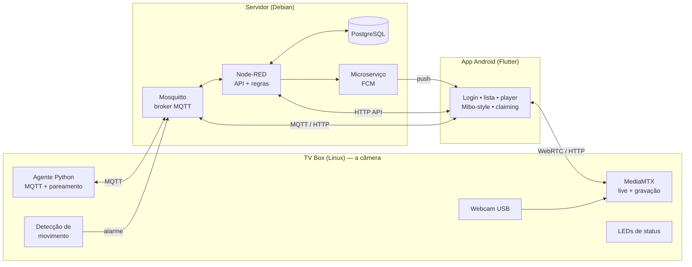

# Equipe 7 — SecBox: Sistema de Segurança com TV Box + App

Projeto do **Hackathon TV Box E10**. Uma **TV Box** (com Linux) faz o papel do equipamento de câmera/alarme e um **aplicativo Android** gerencia os dispositivos remotamente: vídeo ao vivo, gravações, detecção de movimento, notificações e pareamento por QR Code.

> Piloto funcional, validado de ponta a ponta no mundo real.

**Equipe:** Gustavo Henrique Bacci, Rafael Sanchez Nakamura da Silva, Enzo Kawan Da Rocha Vasconcelos, Fernando Toledo de Souza, Leonardo da Silva Paschoal, Victor Thiago Nogueira Ferreira.

---

## Visão geral

Três camadas independentes, comunicando por **MQTT** (controle) e **WebRTC** (vídeo):



**Princípios de projeto**
- **MQTT é o único canal de controle**; vídeo nunca passa pelo MQTT — vai por WebRTC (ao vivo) e HTTP (gravações), direto da câmera pro app.
- **`deviceId` + segredo de fábrica** desde o início (multi-tenant): cada aparelho tem identidade própria e pertence a um usuário.
- Começar **simples e escalável**: o piloto roda tudo enxuto, e cada peça pode ser trocada sem reescrever o resto.

---

## Componentes

### 🎥 Borda — TV Box (Linux, ARM)

| Serviço | Função |
|---|---|
| **MediaMTX** | Captura a webcam (V4L2), serve **WebRTC (ao vivo)**, grava 24/7 no cartão em segmentos, e serve o **playback** das gravações. |
| **Agente** (`agent.py`) | Cliente MQTT: recebe comandos (snapshot, etc.), publica eventos e faz o **modo pareamento** (lê QR pela câmera → conecta Wi-Fi → reivindica o aparelho). |
| **Detecção de movimento** (`motion.py`) | Analisa o stream em baixa resolução (diferença entre quadros) e publica evento de `alarme` ao detectar movimento. |
| **Remux de clipes** (`clip-server.py`) | Converte, sob demanda, o trecho pedido de gravação (fMP4) para MP4 navegável — resolve a linha do tempo com seek no app. |
| **LEDs de status** (`leds.py`) | Controla os LEDs bicolor do painel via GPIO: verde = ok, vermelho = problema/alarme, piscando = pareamento. |
| **Watchdog do SD** | Apaga gravações antigas por espaço livre, evitando encher o disco. |

### 🖥️ Servidor — Debian

| Serviço | Função |
|---|---|
| **Mosquitto** | Broker MQTT (transporte de comandos, eventos e telemetria). |
| **PostgreSQL** | Usuários, dispositivos (com dono/`owner_id`), eventos, sessões e tokens de pareamento. |
| **Node-RED** | Regras e a **API HTTP** do app: `login`, lista de dispositivos, eventos, geração de token de claim, presença (online/offline) e disparo de push. |
| **Microserviço FCM** | Envia as notificações push (Firebase Cloud Messaging) quando um alarme dispara. |

### 📱 App — Flutter (Android) — código em [`app/`](app/)

- **Login** com autenticação (senha com hash bcrypt, sessão persistida).
- **Lista de dispositivos** do usuário (online/offline em tempo real).
- **Player unificado estilo Mibo**: uma tela com ao vivo + gravações numa **régua de tempo por data** (arrastar para navegar), com **zoom**, marcação dos **períodos offline**, marcadores de **movimento**, velocidade de reprodução e tela cheia.
- **Snapshot** e **histórico de eventos**.
- **Adicionar dispositivo por QR**: gera o token, opcionalmente inclui **Wi-Fi** (nome escolhido das redes próximas) — a câmera lê o QR e a box entra na rede e se vincula.
- **Notificações push** de alarme, mesmo com o app fechado.
- Robusto a falhas de rede (timeout + tela de erro).

---

## Fluxos principais

### Onboarding / Pareamento (QR pela câmera)
1. O usuário (logado) abre "Adicionar dispositivo" → o servidor gera um **token de pareamento** (uso único, expira em 15 min).
2. O app monta um **QR** com `{ token, ssid?, senha? }`.
3. A câmera da box lê o QR **offline**; se houver Wi-Fi, a box **conecta na rede**.
4. Já online, o agente envia o **claim** (`deviceId` + segredo + token) ao servidor.
5. O servidor valida e vincula o aparelho ao usuário; o LED de status vira verde.

### Movimento → notificação (autônomo)
`Câmera vê movimento` → `motion.py publica alarme` → `Node-RED busca o dono e dispara o push` → **notificação no celular** + evento gravado + marcador na linha do tempo.

### Vídeo
- **Ao vivo:** o app conecta WebRTC (WHEP) direto na câmera.
- **Gravações:** o app pede um trecho por data/hora; a box remuxa para MP4 navegável e envia.

---

## Stack técnica

- **Borda:** Linux (ARM), MediaMTX, Python (paho-mqtt, libgpiod), ffmpeg, zbar (QR), NetworkManager.
- **Servidor:** Mosquitto, PostgreSQL (+ pgcrypto), Node-RED, Node.js (firebase-admin).
- **App:** Flutter/Dart — `mqtt_client`, `flutter_webrtc`, `video_player`+`chewie`, `firebase_messaging`, `qr_flutter`, `wifi_scan`.
- **Conectividade (piloto):** Tailscale (VPN) entre app, servidor e borda.

---

## Como rodar o app

Pré-requisito: [Flutter](https://docs.flutter.dev/get-started/install) instalado.

```bash
cd app
flutter pub get
flutter run
```

Antes de rodar, configure o ambiente:
1. **`lib/config.dart`** — substitua os placeholders (`SEU_SERVIDOR`, `SUA_TVBOX`, `SUA_SENHA_MQTT`) pelos endereços/credenciais do seu servidor e da sua TV box.
2. **Firebase (push)** — adicione o seu próprio `android/app/google-services.json` (do seu projeto Firebase). Ele **não está versionado** por conter identificadores do projeto.

---

## Estado atual

**Funcional e testado em campo:** vídeo ao vivo + gravação, player unificado, detecção de movimento com push, app completo (login, multi-dispositivo, claiming por QR **com Wi-Fi**), LEDs de status, e o ciclo de onboarding do zero.

**Próximos passos (produção/infra):**
- Sair do Tailscale para um **servidor público** (VPS) com **TLS** e **credencial/ACL por dispositivo** no broker.
- **Autenticação nos endpoints de mídia** ao expor à internet.
- **TURN** (coturn) para o WebRTC funcionar de qualquer rede.
- Hardware: **hub USB com fonte** para a câmera (estabilidade 24/7).

---

## Segurança

- Senhas de usuário com **hash bcrypt**; tokens de sessão e de pareamento com expiração.
- Segredo de fábrica do dispositivo **nunca** exibido (só o hash é guardado).
- No piloto, o perímetro é a VPN (Tailscale); a migração para internet pública inclui TLS ponta a ponta e ACL por dispositivo.

> Nenhuma credencial (senhas, chaves, tokens) está versionada neste repositório.
